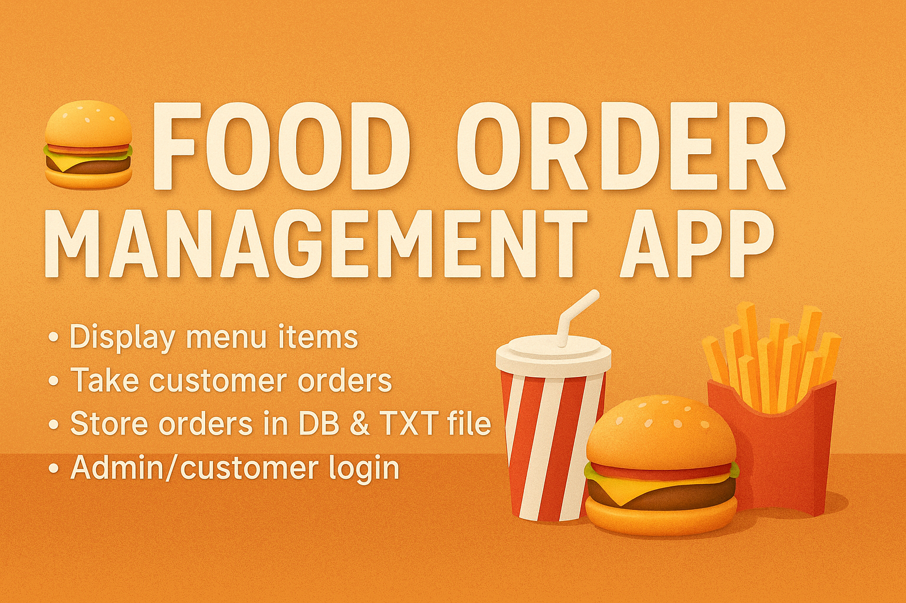

## 📷 Project Banner

  

---

# 🍔 Food Order Management App

A simple console-based restaurant management system.

---

## 📋 Features

- Display the menu items with their prices.
- Add new items to the menu (admin).
- Take customer orders with quantity and calculate total price.
- Store all orders in a database and text file.
- Separate login system for admin and customers.
- Search for orders by customer's name.

---

## 🛠️ Built With

- Python 3
- SQLite3
- File Handling
- Console Interface (Terminal)

---

## 📂 Files Structure

- `main.py`: Main application code.
- `foot_orders.db`: SQLite database to store users, items, and orders.
- `foot_orders.txt`: File to log customer orders.

---

## 🚀 Author

- Developed by [Your Name Here].

